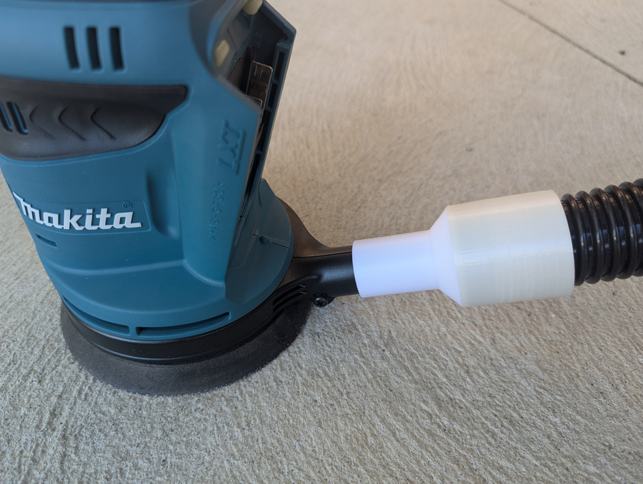

A vacuum adapter for Makita 150mm random orbital sander

This has threading to fit [32mm ID threaded vacuum hose](https://www.amazon.com.au/dp/B0CNVQDPVX), and the smaller nozzle to sleeve cleanly over the sander's dust port, in place of the dust bag.

